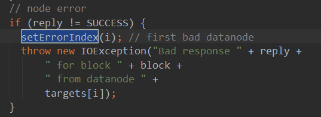

# hadoop错误推断

## 日志中出现没有被catch的NotEnoughReplicasException

根据之前的信息得出：（昨天写过一则分析，主要是针对BlockPlacementPolicyDefault类的）

错误发生在hadoop选取远程节点不得而被迫选取本地节点时，此时本地节点都被占用。log中，第一次选取本地节点时，excludeNodes已经有两个被选中，所以只能选第三个节点作为本地节点。这样所有本地节点都被占满了，而副本数居然还有，于是接下来的操作中就发生了选取远程节点，失败，选取本地节点，抛异常的情况。

excludeNodes中被选中的节点并非固定。

另外，该抛异常有时候发生，有时候不发生。


## Failed to replace a bad datanode

首先找到错误出处：

来自DFSOutputStream


看一下这个类的简介：


简单翻译：

数据分成多个packets，每个packet大小为64KB，一个packet又是由多个chunks组成，一个chunk大小为512B并且有一个checksum与之关联。

客户端所要做的就是填充packet，然后扔进数据队列。DataStreamer（是条线程）将从队列中取packet，送入pipeline（实际上就是一些datanode集合）中的第一个datanode，同时也把它送入ack队列。然后ResponseProcessor（另一条线程）在收到ack后将packet移出ack队列。

当发生错误时，所有未完成的packet将从ack队列移出，然后建立一个新的pipeline使用。

OK上述描述已经很清晰了。我们现在看出错方法是谁调用的：

findNewDataNode <-- addDatanode2ExistingPipeline <-- setupPipelineForAppendOrRecovery

首先看setupPipelineForAppendOrRecovery，我们不过多关注细节，只看它想干什么：


大致可以看出，该方法只在两种情况下会被调用：

- 文件被添加了？
- 数据流错误

暂且不管是哪个原因，我们接着看下一个调用，名称上很直接，想添加datanode到已经存在了的pipeline：

```java
private void addDatanode2ExistingPipeline() throws IOException {
      if (DataTransferProtocol.LOG.isDebugEnabled()) {
        DataTransferProtocol.LOG.debug("lastAckedSeqno = " + lastAckedSeqno);
      }
      /*
       * Is data transfer necessary?  We have the following cases.
       * 
       * Case 1: Failure in Pipeline Setup
       * - Append
       *    + Transfer the stored replica, which may be a RBW or a finalized.
       * - Create
       *    + If no data, then no transfer is required.
       *    + If there are data written, transfer RBW. This case may happens 
       *      when there are streaming failure earlier in this pipeline.
       *
       * Case 2: Failure in Streaming
       * - Append/Create:
       *    + transfer RBW
       * 
       * Case 3: Failure in Close
       * - Append/Create:
       *    + no transfer, let NameNode replicates the block.
       */
      if (!isAppend && lastAckedSeqno < 0
          && stage == BlockConstructionStage.PIPELINE_SETUP_CREATE) {
        //no data have been written，过
        return;
      } else if (stage == BlockConstructionStage.PIPELINE_CLOSE
          || stage == BlockConstructionStage.PIPELINE_CLOSE_RECOVERY) {
        //pipeline is closing，过
        return;
      }
	  // 这个往后就是case3了，findNewDataNode方法在case3，所以我们具体从这里往下看
      int tried = 0;
      final DatanodeInfo[] original = nodes;  // 请记住他
      final StorageType[] originalTypes = storageTypes;
      final String[] originalIDs = storageIDs;
      IOException caughtException = null;
      ArrayList<DatanodeInfo> exclude = new ArrayList<DatanodeInfo>(failed);
      while (tried < 3) {
        LocatedBlock lb;
        //get a new datanode
        lb = dfsClient.namenode.getAdditionalDatanode(
            src, fileId, block.getCurrentBlock(), nodes, storageIDs,
            exclude.toArray(new DatanodeInfo[exclude.size()]),
            1, dfsClient.clientName);
        // a new node was allocated by the namenode. Update nodes.
        setPipeline(lb);  // setpipeline是通过lb来修改掉当前的nodes属性

        //find the new datanode
        final int d;
        try {
          d = findNewDatanode(original);  // 方法体就是在比较nodes和original，找出新添加的datanode，我们的出错点就在这里
        } catch (IOException ioe) {
          // check the minimal number of nodes available to decide whether to
          // continue the write.

          //if live block location datanodes is greater than or equal to
          // HdfsClientConfigKeys.BlockWrite.ReplaceDatanodeOnFailure.
          // MIN_REPLICATION threshold value, continue writing to the
          // remaining nodes. Otherwise throw exception.
          //
          // If HdfsClientConfigKeys.BlockWrite.ReplaceDatanodeOnFailure.
          // MIN_REPLICATION is set to 0 or less than zero, an exception will be
          // thrown if a replacement could not be found.

          if (dfsClient.dtpReplaceDatanodeOnFailureReplication > 0 && nodes.length
              >= dfsClient.dtpReplaceDatanodeOnFailureReplication) {
            DFSClient.LOG.warn(
                "Failed to find a new datanode to add to the write pipeline, "
                    + " continue to write to the pipeline with " + nodes.length
                    + " nodes since it's no less than minimum replication: "
                    + dfsClient.dtpReplaceDatanodeOnFailureReplication
                    + " configured by "
                    + DFSConfigKeys.DFS_CLIENT_WRITE_REPLACE_DATANODE_ON_FAILURE_MIN_REPLICATION_KEY
                    + ".", ioe);
            return;
          }
          throw ioe;  // 这里抛异常了，所以下面的代码不会执行
        }
        
        // 描述如何transfer副本，删了不看
      }
      // All retries failed
      throw (caughtException != null) ? caughtException :
         new IOException("Failed to add a node");
    }
```

所以我们看到replace bad datanode字符串只有一种可能：没有其他datanode可用了，但此时副本还没安排完。

没有datanode可用？为什么就没有可用datanode了？为什么已经存在的pipeline不用还需要添加新的datanode进去？

比较有可能的原因：有些节点bad了。是否有节点bad可以这么看：

有个failed属性，他被作为excludeNode传给namenode：


而failed在这里赋值的：


也就是说，如果有failed节点存在，则在datanode节点搜索WARN应该可以看到上述的log，并且应该会直接给出bad datanode的ip地址。

什么样的datanode会被标记为failed呢？

我们可以追溯errorIndex是怎么被赋值的：




该代码存在于ResponseProcessor线程，也就是说数据写过去了但ack失败。

因此若出现ack没有回应，那就是bad datanode。

ack没回应的原因：

- 网络拥塞
- 写入错误

网络拥塞的可能性小，原因是：

```java
/** DataStreamer的run方法 */
			// get packet to be sent.
            if (dataQueue.isEmpty()) {
              one = createHeartbeatPacket();
              assert one != null;
            } else {
              try {
                backOffIfNecessary();  //这里做了拥塞处理，如果拥塞，会有log输出
              } catch (InterruptedException e) {
                DFSClient.LOG.warn("Caught exception ", e);
              }
              one = dataQueue.getFirst(); // regular data packet
              SpanId parents[] = one.getTraceParents();
              if (parents.length > 0) {
                scope = dfsClient.getTracer().
                    newScope("dataStreamer", parents[0]);
                scope.getSpan().setParents(parents);
              }
            }
          }

          // get new block from namenode.
          if (stage == BlockConstructionStage.PIPELINE_SETUP_CREATE) {
            if(DFSClient.LOG.isDebugEnabled()) {
              DFSClient.LOG.debug("Allocating new block");
            }
            setPipeline(nextBlockOutputStream());
            initDataStreaming();
          } else if (stage == BlockConstructionStage.PIPELINE_SETUP_APPEND) {
            if(DFSClient.LOG.isDebugEnabled()) {
              DFSClient.LOG.debug("Append to block " + block);
            }
            setupPipelineForAppendOrRecovery();  // 这里才是我们调用出错的位置
            if (true == streamerClosed) {
              continue;
            }
            initDataStreaming();
          }
```

也就是，我们可以通过在datanode节点查询拥塞输出的日志确认网络是否有问题，拥塞输出的日志为：

are congested. Backing off for

