# class文件解读

class文件内容是一堆字节码，遵循**高位在前**的方式。

> 高位在前，也就是大端模式。

## 数据类型

只有两种数据类型：

- 无符号数
- 表

### 无符号数

基本数据类型，用来描述

- 数字
- 索引引用
- 数量值
- UTF-8编码的字符串

### 表

表是复合数据类型，由多个无符号数和其他表构成，以“_info”结尾。

class文件本质是一张表。

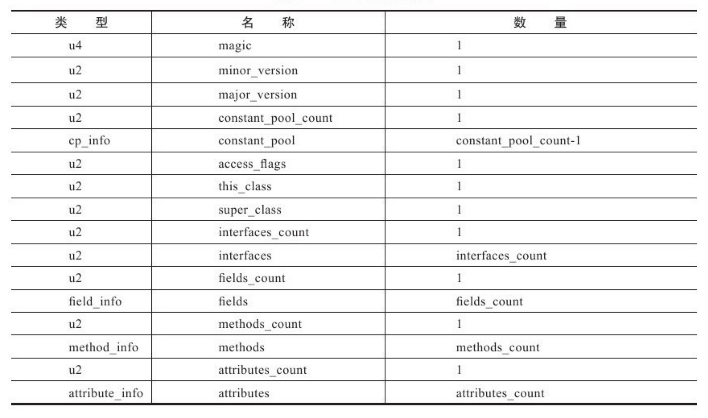

## 从头开始

### 魔数

4字节，指明java能解析的格式。

### 版本号

次版本号（2字节）、主版本号（2字节），指明java版本。

### 常量池

常量池计数器，1字节。指明常量由多少个。

常量池计数器是从1开始计数的。所以，如果该计数器值为22，则说明有21个常量（22把0也算在里面）。

剩下的部分为常量类型，有两大类：

- 字面量
- 符号引用

具体的：

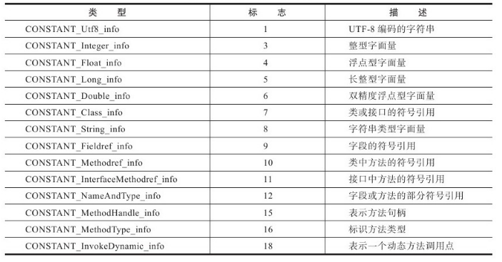

每个类型都有自己的数据结构。

有个共同点，就是：首位都是tag，用来指明当前常量属于什么类型。

具体读法：

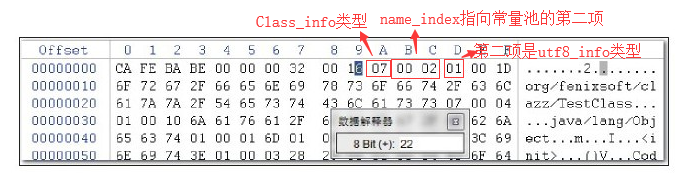

class_info类型的数据结构：


其中name_index表示指向常量池中的第几个。

utf8_info的数据结构：

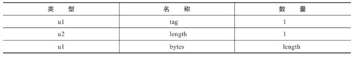

这里length是2字节，说明utf8_info型常量的最大长度，或者说java中方法和字段名的最大长度为65535。

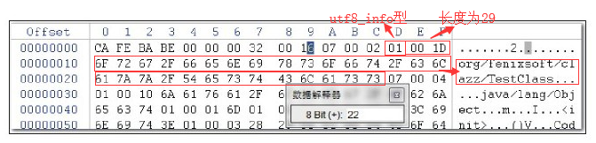

其他常量遵循该方法解读即可，以下常量结构表用于参考。


### 访问标志

2字节，指明是类还是接口、是否为public等。

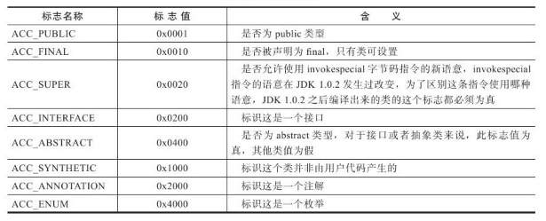

### 类索引、父类索引和接口索引

索引的意思是该类的全限定名在常量池中的哪个位置。比如：

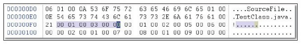

分别为2个字节：

- 类索引为1；

- 父类索引为3；

- 接口计数器为0，因此后面没有接口索引表

根据该索引我们就可以在常量池中找到对应的全限定名。

### 字段表集合

描述接口或类中声明的变量，类级、实例级变量，不包括方法的局部变量。示例：

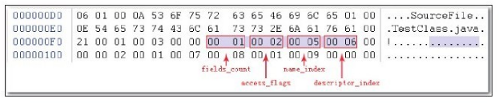

先指明有多少个字段，然后是这个字段的获取权限是什么（public、private、static等），然后指明字段叫什么，最后是它的数据类型是什么。

字段的access_flags：

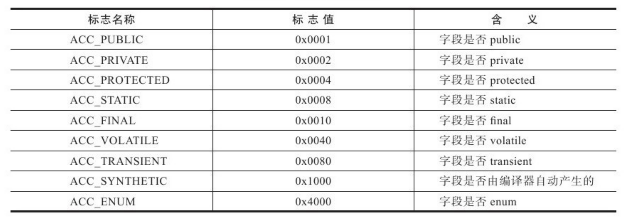

字段的描述符descriptor_index：

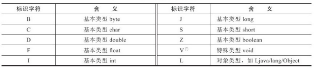

如果是数组，用“[+类型”表示。多维数组就多加几个括号。

实际上，除上述信息要给出以外，字段还有两块信息：属性表计数器、属性表。下面给出字段的数据结构（按箭头顺序读）：

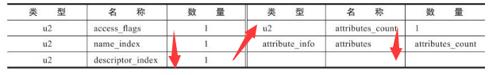

### 方法表集合

方法表的结构和字段表结构一样，不过在access_flags和属性表这两块内容上会有些区别。示例：

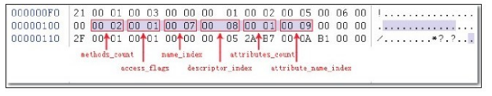

方法表的access_flags：

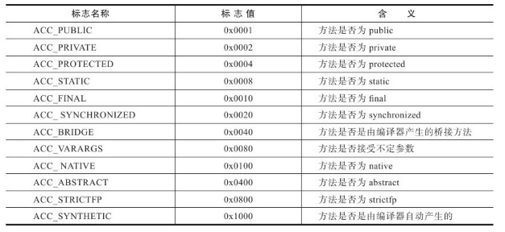

### 属性表集合

属性有很多，比如Code、ConstantValue等，每种属性虽都有自己特有的数据结构，但整体都遵循以下统一的结构排布：

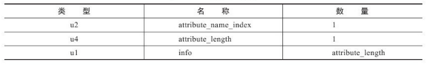

Code属性最为重要，因此这里只介绍它。

Code属性的数据结构如下：

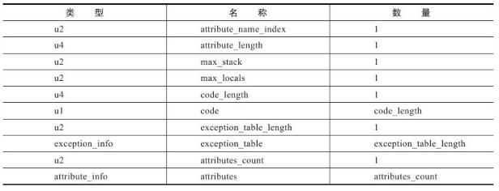

其中：

- max_stack：操作数栈的最大深度

- max_locals：局部变量表的大小

- code_length：代码长度，虽然是4字节，但实际只允许使用2字节，意思是代码长度不允许超过65535条。

- code：具体的代码指令，类似汇编指令，“操作码 + 操作数”，这里操作码是1字节，操作数的字节数根据查对应指令获得。

示例解读，主要看code部分：

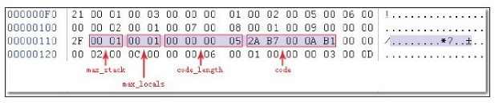

2A：aload_0

B7：invokespecial

00 0A：invoke special的参数，指向常量池中的某个值

B1：return

## 一个例子：Hello.class

Hello程序的代码如下：

```java
public class Hello {
    public static void main(String[] args) {
        System.out.println("Hello world");
    }
}
```

采用javac编译成class文件：

```bash
javac Hello.java
```

采用javap反编译：

```bash
javap -verbose Hello.class
```

反编译结果如下：

```
Classfile /D:/files/workspace/idea/helloworld/out/production/helloworld/Hello.class
  Last modified 2019-10-3; size 518 bytes
  MD5 checksum 028c873d106c510ec6ff389d95955b62
  Compiled from "Hello.java"
public class Hello
  minor version: 0
  major version: 52
  flags: ACC_PUBLIC, ACC_SUPER
Constant pool:
   #1 = Methodref          #6.#20         // java/lang/Object."<init>":()V
   #2 = Fieldref           #21.#22        // java/lang/System.out:Ljava/io/PrintStream;
   #3 = String             #23            // Hello world
   #4 = Methodref          #24.#25        // java/io/PrintStream.println：(Ljava/lang/String;)V
   #5 = Class              #26            // Hello
   #6 = Class              #27            // java/lang/Object
   #7 = Utf8               <init>
   #8 = Utf8               ()V
   #9 = Utf8               Code
  #10 = Utf8               LineNumberTable
  #11 = Utf8               LocalVariableTable
  #12 = Utf8               this
  #13 = Utf8               LHello;
  #14 = Utf8               main
  #15 = Utf8               ([Ljava/lang/String;)V
  #16 = Utf8               args
  #17 = Utf8               [Ljava/lang/String;
  #18 = Utf8               SourceFile
  #19 = Utf8               Hello.java
  #20 = NameAndType        #7:#8          // "<init>":()V
  #21 = Class              #28            // java/lang/System
  #22 = NameAndType        #29:#30        // out:Ljava/io/PrintStream;
  #23 = Utf8               Hello world
  #24 = Class              #31            // java/io/PrintStream
  #25 = NameAndType        #32:#33        // println:(Ljava/lang/String;)V
  #26 = Utf8               Hello
  #27 = Utf8               java/lang/Object
  #28 = Utf8               java/lang/System
  #29 = Utf8               out
  #30 = Utf8               Ljava/io/PrintStream;
  #31 = Utf8               java/io/PrintStream
  #32 = Utf8               println
  #33 = Utf8               (Ljava/lang/String;)V
{
  public Hello();
    descriptor: ()V
    flags: ACC_PUBLIC
    Code:
      stack=1, locals=1, args_size=1
         0: aload_0
         1: invokespecial #1                  // Method java/lang/Object."<init>":()V
         4: return
      LineNumberTable:
        line 1: 0
      LocalVariableTable:
        Start  Length  Slot  Name   Signature
            0       5     0  this   LHello;

  public static void main(java.lang.String[]);
    descriptor: ([Ljava/lang/String;)V
    flags: ACC_PUBLIC, ACC_STATIC
    Code:
      stack=2, locals=1, args_size=1
         0: getstatic     #2                  // Field java/lang/System.out:Ljava/io/PrintStream;
         3: ldc           #3                  // String Hello world
         5: invokevirtual #4                  // Method java/io/PrintStream.println:(Ljava/lang/String;)V
         8: return
      LineNumberTable:
        line 3: 0
        line 4: 8
      LocalVariableTable:
        Start  Length  Slot  Name   Signature
            0       9     0  args   [Ljava/lang/String;
}
SourceFile: "Hello.java"

```

可以看到，常量池中的各常量均以#号开头。

接下来的一段是构造器代码：

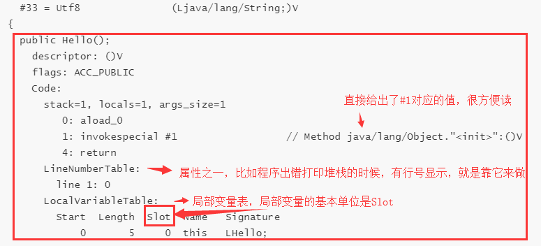

>  32位以下的基本类型占一个Slot，以上的占2个。

最后一部分是main方法。

所以，class文件实际的内容是：

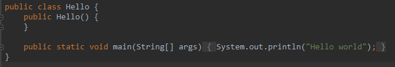

比java文件多了个构造器。

## 参考

[从一个class文件深入理解Java字节码结构](https://www.jianshu.com/p/2c106b682cfb)


