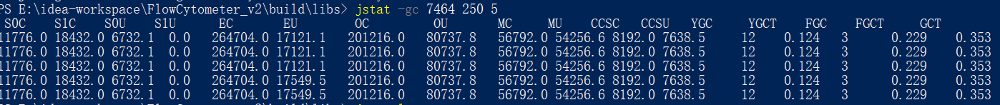
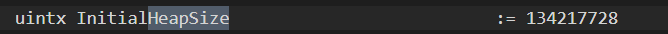
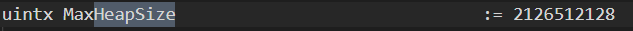
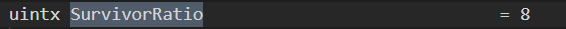
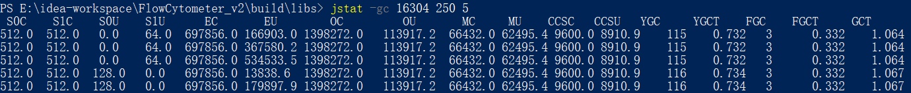
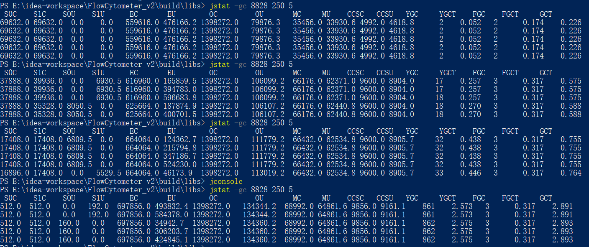
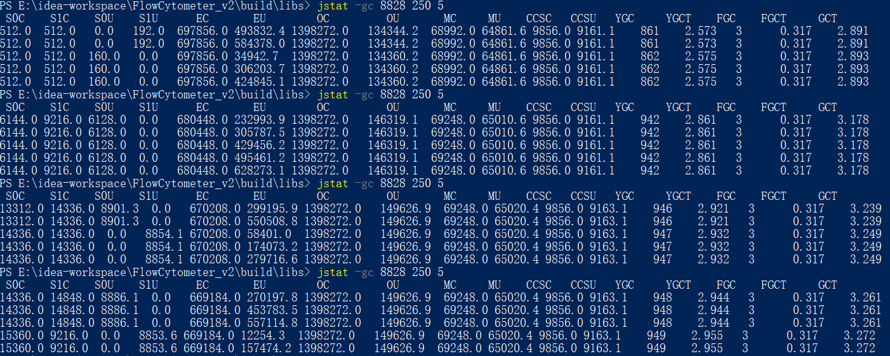

# jvm选项设置实战

## 目标程序：FlowCytometer-2.4.2

现象：在使用默认选项时，Young GC频繁。

查看内存划分：

```bash
jstat -gc 7464 250 5
```



发现S0和S1的容量只有11M左右。

输出默认选项：

```bash
java -XX:+PrintFlagsInitial -version >> DefaultOptions.txt
```

查看堆大小，发现初始为128M，最大为2G，SurvivorRatio为8，也就是采用8:1:1分配：







扩容，固定堆大小为2G：

```bash
java -Xms2g -Xmx2g -jar FlowCytometer-2.4.2.jar
```

重新查看内存划分：



发现S0和S1空间只剩512K？

明确指明SurvivorRatio：

```bash
java -Xms2g -Xmx2g -XX:SurvivorRatio=8 -jar FlowCytometer-2.4.2.jar
```

再查看内存分配：



卧槽，S0和S1最开始符合预期，但之后又缩回512K。

后面测试时确认，**新生代容量会动态调节**，当程序闲置的时候，容量会缩，如果程序Busy时，又会扩起来：



老年代空间不会受影响。

这些选项是否能减少GC次数？

指标：比较点击开始采集后一分钟内的GC次数

| GC次数   | 默认jvm选项 | -Xms2g -Xmx2g -XX:SurvivorRatio=8 | -Xms2g -Xmx2g -XX:SurvivorRatio=8 -XX:-UsePSAdaptiveSurvivorSizePolicy |
| -------- | ----------- | --------------------------------- | ------------------------------------------------------------ |
| 开始采集 | 59          | 47                                | 92                                                           |
| 一分钟后 | 110         | 97                                | 150                                                          |
| 总计     | 51          | 50                                | 58                                                           |

可以看到，默认选项的GC速率和新设置选项的速率一致，因此无效。

新生代空间动态调节的开关找到了，是`-XX:+UsePSAdaptiveSurvivorSizePolicy`，这个是Parallel Scavenge收集器特有的动态调节策略选项。

关闭该选项后GC次数在58，如上表所示。

现在明白一个事实：Young GC受Eden空间影响，而不是S0和S1，Eden是新建对象的地方，扩大S0和S1的容量只保证不发生对象晋升。

两分钟内GC停顿时间在0.9秒左右，比值0.9/120=0.0075，完全可以接受的。

**故GC不是影响性能的主要因素。**

