# 垃圾回收

## 判断对象已死的方法

有两种：

- 引用计数法
- 可达性分析法

java采用的是可达性分析法。

### 为什么不用引用计数法	

难以解决对象循环引用的问题，如：

```java
public class ReferenceCountingGC {
    public Object instance = null;
    private static final int _1MB = 1024 * 1024;
    private byte[] bigSize = new byte[2 * _1MB];
    
    public static void testGC() {
        ReferenceCountingGC objA = new ReferenceCountingGC();
        ReferenceCountingGC objB = new ReferenceCountingGC();
        objA.instance = objB;
        objB.instance = objA;
        objA = null;
        objB = null;

        System.gc();
	}
}
```

通过加jvm选项`-XX:+PrintGCDetails`，得如下信息：

```
[GC (System.gc()) [PSYoungGen: 6763K->728K(38400K)] 6763K->736K(125952K), 0.0020378 secs] [Times: user=0.00 sys=0.00, real=0.00 secs] 
[Full GC (System.gc()) [PSYoungGen: 728K->0K(38400K)] [ParOldGen: 8K->621K(87552K)] 736K->621K(125952K), [Metaspace: 3434K->3434K(1056768K)], 0.0092880 secs] [Times: user=0.02 sys=0.00, real=0.01 secs] 
Heap
 PSYoungGen      total 38400K, used 998K [0x00000000d5c00000, 0x00000000d8680000, 0x0000000100000000)
  eden space 33280K, 3% used [0x00000000d5c00000,0x00000000d5cf9b38,0x00000000d7c80000)
  from space 5120K, 0% used [0x00000000d7c80000,0x00000000d7c80000,0x00000000d8180000)
  to   space 5120K, 0% used [0x00000000d8180000,0x00000000d8180000,0x00000000d8680000)
 ParOldGen       total 87552K, used 621K [0x0000000081400000, 0x0000000086980000, 0x00000000d5c00000)
  object space 87552K, 0% used [0x0000000081400000,0x000000008149b450,0x0000000086980000)
 Metaspace       used 3446K, capacity 4496K, committed 4864K, reserved 1056768K
  class space    used 376K, capacity 388K, committed 512K, reserved 1048576K
```

着重看**6763K->728K**，可以推出2MB的`ReferenceCountingGC`已经被回收，故非引用计数。

### 可达性分析法

选取一些对象作为GC Roots，然后顺着引用搜索。这些对象是：

- 虚拟机栈（栈帧中的本地变量表）中引用的对象
- 方法区中类静态属性引用的对象
- 方法区中常量引用的对象
- 本地方法栈中JNI引用的对象

> 虚拟机栈和本地方法栈都是线程栈，方法区就是永久代，具体参考[这一篇博文](https://juejin.im/post/5ad5c0216fb9a028e014fb63)

## 垃圾收集算法

主要有：

- 标记-清除
- 复制
- 标记-整理
- 分代收集

### 标记-清除

最基础的收集算法，后续都基于此演进。

过程：就是按照名称那样，先标记后清除。

缺点：

- 效率问题：标记和清除效率都不高
- 空间问题：内存碎片

### 复制

目的：为解决效率问题。

过程：内存分为两块，每次只使用其中一块，当一块用完了，就将其中存活的对象复制到另一块上，然后清除已使用的那块内存。

用在哪：Eden + S0 + S1，默认比例：8:1:1。

用法：每次回收时，就将Eden和其中一块Survivor中存活的对象复制到另一块Survivor上。

> Q：如果Survivor空间不够怎么办？
>
> A：那就直接进老年代。

### 标记-整理

目的：

- 不想浪费50%的空间
- 极端情况，对象100%存活时，多次复制的效率问题。

过程：先标记，然后整理，将存活的对象向内存一端移动，然后直接清理掉边界以外的内存。

用在哪：老年代

### 分代收集

也就是分新生代和老年代，然后根据各自的特点进行不同的垃圾回收。

## 垃圾收集器

垃圾收集算法的具体实现。

一张图描述搭配建议：

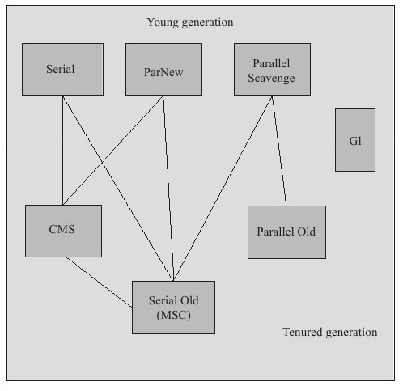

### Serial收集器

最基本的收集器，单线程，Stop the world，Client模式的默认收集器。

Serial和Serial Old（Serial的老年代版）的回收过程：

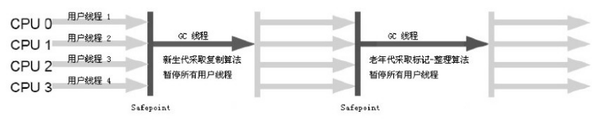

适合：

- 单CPU环境
- 虚拟机内存不大，新生代收集在几十到一两百兆以内
- 不频繁发生

### ParNew收集器

Serial收集器的多线程版本。可以简单认为，除了多线程，其他全部和Serial一致。

ParNew和Serial Old的回收过程：

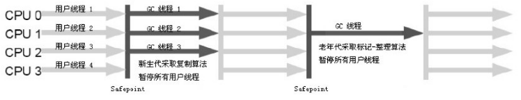

不适合CPU少的环境。

怎么用：选项`-XX:+UseConcMarkSweepGC`默认ParNew为新生代收集器，也可以强制指定：`-XX:+UseParNewGC`

### Parallel Scavenge收集器

和ParNew基本相同，多线程、使用复制算法等，唯一的区别是关注点不同：

- ParNew等收集算法致力于尽可能地缩短GC时间
- Parallel Scavenge致力于缩短运行用户代码时间和GC时间的比值（也就是吞吐量）

吞吐量公式：
$$
吞吐量 = \frac{运行用户代码的时间}{运行用户代码的时间 + GC时间}
$$
Parallel Scavenge和Parallel Old的回收过程：

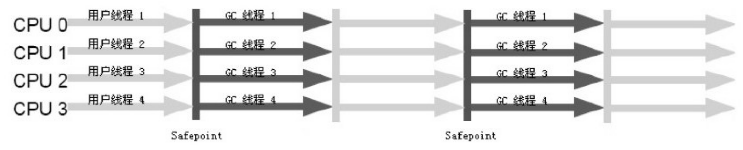

适合在后端等不需要人机交互的场景使用。

怎么用：有两个参数：`-XX:MaxGCPauseMillis`和`-XX:GCTimeRatio`

1. `-XX:MaxGCPauseMillis`指定GC停顿时间的上界

2. `-XX:GCTimeRatio`指定比率，值为运行用户代码的时间份数，GC时间为1份。例：值为19，意味着吞吐量为5%，即1/(1+19)。

### CMS收集器

并发收集、低停顿。四个阶段：

- 初始标记：stop the world，搜索GC Roots下的直接引用对象
- 并发标记：搜索引用链
- 重新标记：stop the world，修正并发标记期间因用户程序继续运作而导致标记产生变动的那一部分对象的标记记录
- 并发清理

并发标记和并发清理耗时比其他两阶段长。

回收过程：

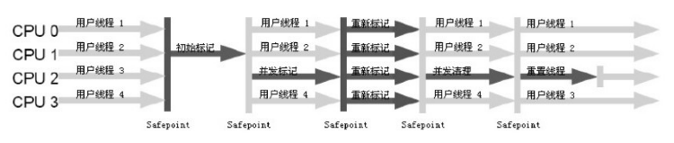

缺点：

- 对CPU资源非常敏感。启动的线程数为：(CPU数 + 3) / 4，CPU数越少GC线程占用的资源越多。不适合4核及以下的环境。
- 在一次运作过程中会有浮动垃圾（即标记完以后出现的垃圾），这部分垃圾的空间需要考虑预留（Serial Old就不需要，老年代空间几乎填满再清理都不迟，因为stop the world了）。`-XX:CMSInitiatingOccupancyFraction`控制预留大小，太大容易导致“Concurrent Mode Failure”，从而触发Full GC，性能反而降低。
- 基于“标记-清除”算法，有空间碎片，因此需要FullGC整理，默认开启的选项：`-XX:UseCMSCompactAtFullCollection`。

### G1收集器

面向服务器应用的收集器，它的使命是替换掉CMS收集器。原理是将Java堆划分为多个大小相等的区域Region，然后Garbage First，优先回收价值最大的Region。四个阶段：

- 初始标记
- 并发标记
- 最终标记
- 筛选回收

> 比较复杂，具体四个阶段各做什么事不懂。

回收过程：

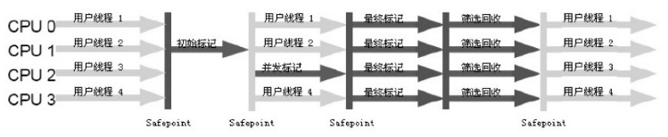

## GC日志解读

GC和Full GC的区别：

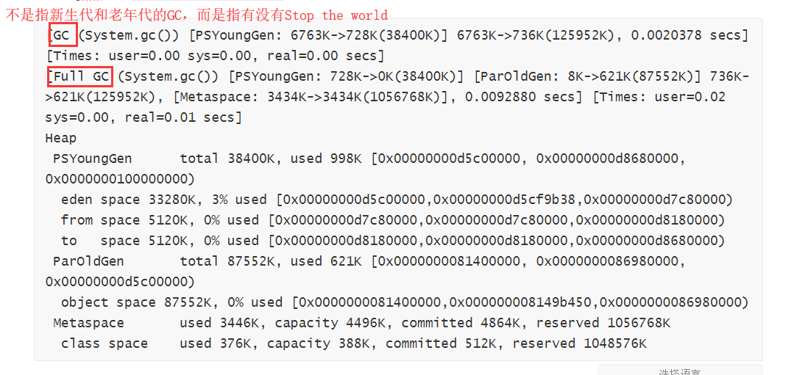

回收区域的名称，如果是

- Serial收集器：[DefNew
- ParNew收集器：[ParNew
- Parallel Scavenge收集器：[PSYoungGen

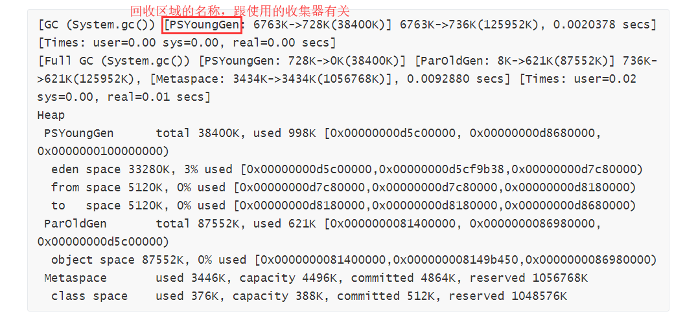

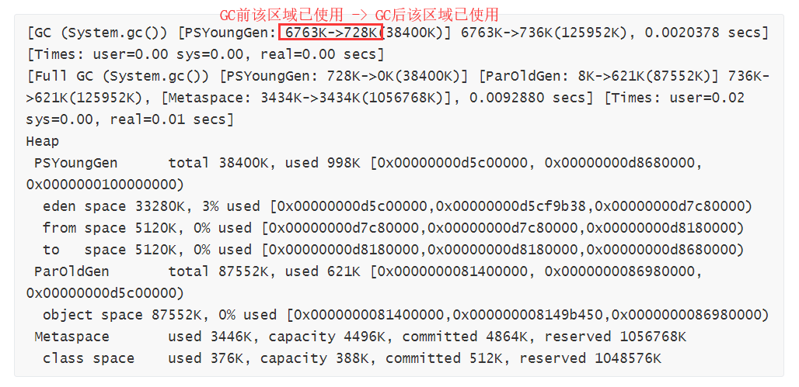

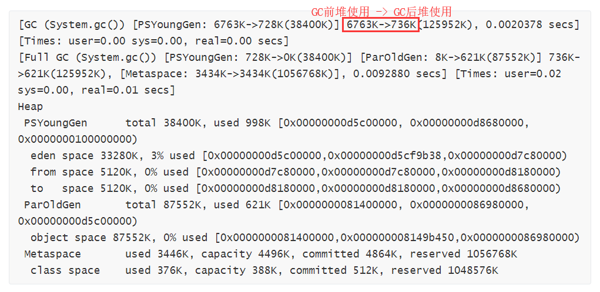

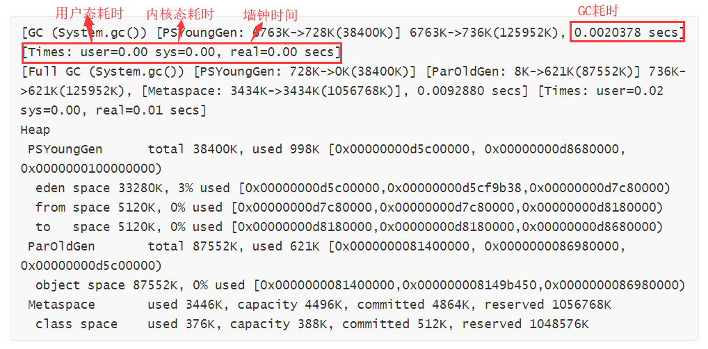

墙钟时间与CPU时间的区别：墙钟时间包含等待时间，而CPU时间只考虑CPU的使用时间。

## 相关jvm选项

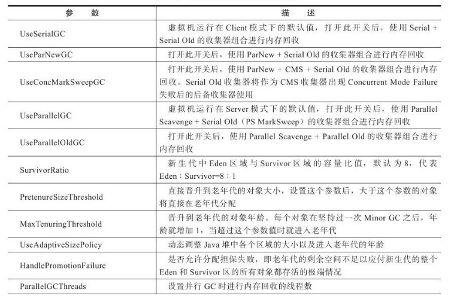

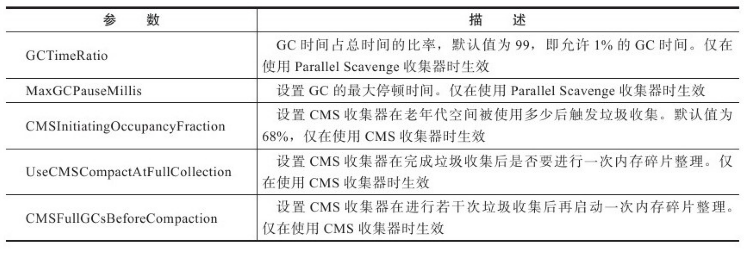

