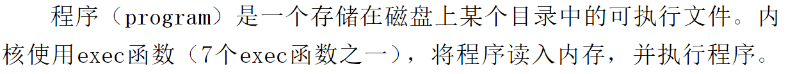
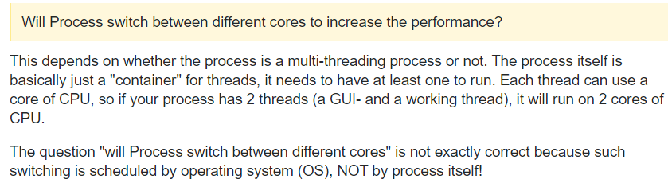

# 一个进程是否只对应一个CPU

一个进程在运行的时候是否只使用一个CPU，像任务管理器中CPU占用率为100%，意味着什么？所有CPU都被用了吗？

## 分析

首先需要明确进程是什么？

进程要区别于程序，程序是存储在磁盘上的可执行文件：

而进程是程序的执行实例（instance）。

> In computing, a **process** is the [instance](https://en.wikipedia.org/wiki/Instance_(computer_science)) of a [computer program](https://en.wikipedia.org/wiki/Computer_program) that is being executed by one or many threads.  It contains the program code and its activity.  -- Wiki

因此，进程运行的实质就是在执行程序的代码。

代码是要编译成机器指令的。

进程的运行就是要跑这些编译的指令。

一个核（core）只能受理一条指令流水线。

那么进程应该对应一个core，而不是一个CPU，因为现阶段技术一个CPU可以有好几个核。

Quora上有个问题可能对进程与CPU关系的理解有帮助：

> Actually, it only runs two at any moment. It executes four. And your OS pushes that number to several thousands. Now how does that work? It depends on distinguishing running: actually running, being executed, and being active.
>
> Let’s start really low. A dual core CPU has *two cores*. Cores can run one instruction set at a time (possibly using SIMD and the like to do multiple things at once). This instruction belongs to one process. So, you get one process running per core. That’s *two processes running on a dual core*.
>
> One level up, each core has 2 threads thanks to Hyperthreading/SMT. A dual core CPU with SMT has *four threads*. Each two threads still share one core, so they still *only run one instruction at a time*. However, each thread holds one set of instructions. This gives some benefit when fetching the next set of instructions takes long. While thread 1 is running, thread 2 fetches its next instructions. So, you get two processes being executed per core. That’s *four processes executing on a dual core*.
>
> At the highest level, the operating system is a process managing processes. A program does not run on the processor by itself - the OS lets the program run. In this regard, the OS can keep an arbitrary number of processes active - it just needs the memory to hold them. **However, while all those processes are active, only four can be in the CPU, and only two can run.**
>
> An analogy:
>
> Think of a full-body-scanner at airport security. There is room for only one person in the scanner. The scanner is a CPU core, each person a process; *one person can be scanned at a time.*
>
> People have to take off their shoes and belts, and empty their pockets before scanning. For each scanner, there are two preparation areas for persons to do this. The preparation areas are threads; *two persons can prepare at the same time*.
>
> There is a loooooong waiting queue. Queued people are technically being inspected, but are sorted to scanners and preparation areas only at the end. The queue is the OS’ memory of active processes; *as many persons can be inspected as there is waiting room*.

现在又有一个问题：

一个进程能在多个core上运行吗？

可以！进程本质只是线程的容器，不同线程可以在多核上运行，说明进程可以。

上面两个回答都在强调的一点是：进程不是自己运行的，而是OS让它运行的，因此进程能不能跑在多核上，那是OS的本事。

## 结论

一个进程可以对多个CPU。CPU占用率100%意味着该进程将所有CPU都用了。

