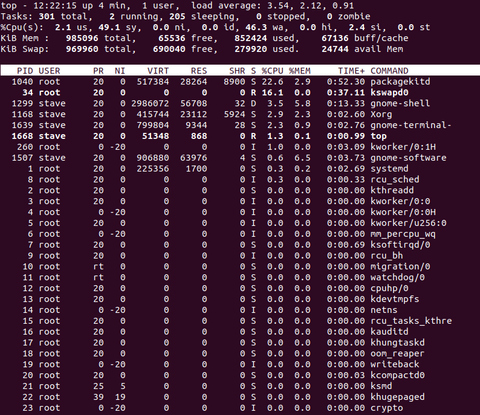
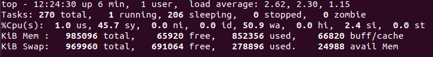
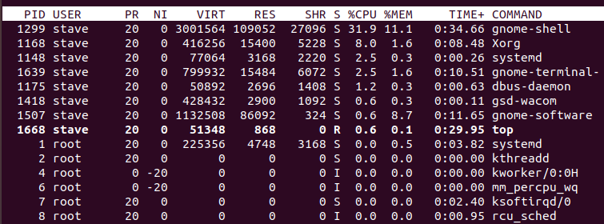

# top

最基本的页面：

```bash
top
```



大致可以看出有两个区域。

## 第一个区域：汇总区域

首先看第一个区域：



该区域中分别有：

- 系统时间
- 平均负载
- 任务详情：也就是进程数，可以通过按“H”切换为线程数。
- cpu使用情况： 可按“t”切换视图
- 内存使用情况：可按“m”切换视图

### 内存

**什么是swap？**

swap分区，本质是disk。作用是当内存不够用的时候将一些很长时间没什么操作的程序临时保存到swap分区，然后释放该程序内存供其他程序使用。

显然，大量使用swap分区对性能有影响。

**什么是buff/cache？**

buff/cache = buff + cache

有一种比较简单但不是很准确的理解：

buff是指正在写入的数据，在写入完成之前不能回收的内存；

cache是指已读取的数据，保存在附近，以防止需要再次读取。由于始终可以从磁盘重新读取，所以可以立即回收。

**什么是avail mem？**

avail mem衡量在不引起更多交换的情况下可以分配和使用的内存量。


### CPU使用情况

us：执行用户调用的时间

sy：执行系统调用的时间

ni：nice，优先级，值越大优先级越小（这种汇总的优先级有什么用呢？）

id：idle，空闲时间

wa：等待IO执行完成的时间

hi和si：分别是硬中断和软中断，硬中断，比如键盘；软中断，特殊指令引起的中断

st：steal，针对虚拟机的，比如有个核被两个虚拟机共享，现在有个虚拟机想要执行某个任务而不得，原因是另一个虚拟机正在使用它，此时lost的时间即为st


### 平均负载

在右上角，可以看到有三个值，分别是1,5,15分钟的一个平均负载统计情况。衡量你可能需要多长时间来完成某些任务。

比如0.4，意味着有40%的工作量正在处理。如果是1，则有100%工作量，此时在给它加一点工作都是过载的。

## 第二个区域：任务区域




**%CPU**

CPU占用率，按“P”可以根据该列排序。

**NI和PR**

ni就是nice值了，pr则是从内核角度显示进程的调度优先级，所以二者是相互关联的。

**VIRT, RES, SHR and %MEM**

分别是虚拟内存、驻留内存、共享内存以及内存使用率，这里说下驻留内存是真正使用的内存。

按“M”根据%MEM排序。

**S**

进程的状态。

**TIME+**

进程存在的时间，按“T”可以根据该列排序。

**COMMAND**

进程名。可以按“c”显示具体的路径，按“V”显示进程的父子关系。


## 参考

https://www.booleanworld.com/guide-linux-top-command/