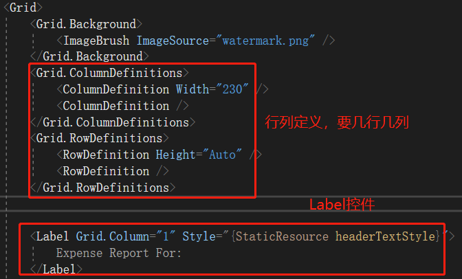

# WPF

比Winform更好看的窗体应用。

基本目录：

- App.xaml：定义一些css style
- App.config
- MainWinow.xaml：定义控件布局

## 视图xaml

视图采用的是xaml格式的描述符。

### 根元素

- Window：单页面窗口，也是默认的窗口
- NavigationWindow：类似浏览器，与Window的区别是，多了一个导航栏


- Page：类比网页，作为根元素的Source来使用。


将NavigationWindow改为Window后，Source属性不能用，这样似乎说明Page只能用在NavigationWindow上。

### 布局

官网的定义：


StackPanel：相当于javafx的HBox/VBox

WrapPanel：相当于javafx的FlowPane

#### Grid布局

Grid元素内嵌两部分内容：

- Grid的Row、Column定义
- 要放置的控件




### 样式

在App.xaml中定义如下：


使用：


所以上述Style写法对应css就是：

```css
#listHeaderTextStyle {
    Foreground: White;
    VerticalAlignment: Center;
    HorizontalAlignment: Left;
}
```

唯一多了一个约束是：TargetType，定义只能用在哪个控件上。

> *ml描述符写起来确实不如json方便...

### 最原始的数据源

Grid.Resources：一种inline形式的DataSource包含两部分：

- Provider：数据
- template：这些数据要用哪些属性显示

```xaml
<Grid Margin="10,0,10,10">
        <Grid.Resources>
            <!-- Expense Report Data -->
            <XmlDataProvider x:Key="ExpenseDataSource" XPath="Expenses">
                <x:XData>
                    <Expenses xmlns="">
                        <Person Name="Mike" Department="Legal">
                            <Expense ExpenseType="Lunch" ExpenseAmount="50" />
                            <Expense ExpenseType="Transportation" ExpenseAmount="50" />
                        </Person>
                        <Person Name="Lisa" Department="Marketing">
                            <Expense ExpenseType="Document printing"
          ExpenseAmount="50"/>
                            <Expense ExpenseType="Gift" ExpenseAmount="125" />
                        </Person>
                        <Person Name="John" Department="Engineering">
                            <Expense ExpenseType="Magazine subscription" 
         ExpenseAmount="50"/>
                            <Expense ExpenseType="New machine" ExpenseAmount="600" />
                            <Expense ExpenseType="Software" ExpenseAmount="500" />
                        </Person>
                        <Person Name="Mary" Department="Finance">
                            <Expense ExpenseType="Dinner" ExpenseAmount="100" />
                        </Person>
                    </Expenses>
                </x:XData>
            </XmlDataProvider>
            <!-- Name item template -->
            <DataTemplate x:Key="nameItemTemplate">
                <Label Content="{Binding XPath=@Name}"/>
            </DataTemplate>
        </Grid.Resources>
    </Grid>
```

使用方式为，要指明两点：

- ItemsSource：item数据哪来的
- ItemsTemplate：**模板**，定义要显示哪些字段

```xaml
<ListBox Name="peopleListBox" Grid.Column="1" Grid.Row="2" 
            ItemsSource="{Binding Source={StaticResource ExpenseDataSource}, XPath=Person}"
         ItemTemplate="{StaticResource nameItemTemplate}">
</ListBox>
```

### 数据绑定

#### 基本要素

数据绑定的4个要素：

- 目标对象：比如TextBox
- 目标属性：比如TextBox的text属性
- 被绑定的源：比如一个Person对象
- 被绑定的值：比如Person对象的name属性

> WPF能够绑定的源不仅仅是对象，也可以是xml等。

#### 绑定方向

绑定的方向有三个：


设置方法：通过`Binding.Mode`属性改变。

为检测到source改变，source需要实现`INotifyPropertyChanged`接口，示例：

```C#
using System.ComponentModel;

namespace SDKSample
{
  // This class implements INotifyPropertyChanged
  // to support one-way and two-way bindings
  // (such that the UI element updates when the source
  // has been changed dynamically)
  public class Person : INotifyPropertyChanged
  {
      private string name;
      // Declare the event
      public event PropertyChangedEventHandler PropertyChanged;

      public Person()
      {
      }

      public Person(string value)
      {
          this.name = value;
      }
      
      public string PersonName
      {
          get { return name; }
          set
          {
              name = value;
              // Call OnPropertyChanged whenever the property is updated
              OnPropertyChanged("PersonName");
          }
      }

      // Create the OnPropertyChanged method to raise the event
      protected void OnPropertyChanged(string name)
      {
          PropertyChangedEventHandler handler = PropertyChanged;
          if (handler != null)
          {
              handler(this, new PropertyChangedEventArgs(name));
          }
      }
  }
}
```

#### 绑定触发时机

比如输入框，可以是实时更新，也可以是失去焦点后更新，我们应该通过什么来定义？

使用`Binding.UpdateSourceTrigger`

- `UpdateSourceTrigger.PropertyChanged`：实时传播
- `UpdateSourceTrigger.LostFocus`：失去焦点后传播

#### 绑定数据类型不一致怎么办

比如背景色与字符串属性绑定，但背景色类型是Brush，怎么转？

A：定义一个Converter，实现`IValueConverter`接口，示例：

```C#
[ValueConversion(typeof(Color), typeof(SolidColorBrush))]
public class ColorBrushConverter : IValueConverter
{
    public object Convert(object value, Type targetType, object parameter, System.Globalization.CultureInfo culture)
    {
        Color color = (Color)value;
        return new SolidColorBrush(color);
    }

    public object ConvertBack(object value, Type targetType, object parameter, System.Globalization.CultureInfo culture)
    {
        return null;
    }
}
```

#### xaml中应该怎么写绑定代码

和前面介绍的【最原始的数据源】一致，需要在xaml中指定：数据源；要绑什么属性。具体有两种：

第一种，借助DataContext：


第二种，比较直接，如果控件的父节点的其他子节点没有要使用这个数据源的话，用这种会方便些：


Q：上面绑定方法明确指定了绑定什么属性，假如想绑定整个类的所有属性，怎么做？

A：只写一个{Binding}就好了，把Path省掉。


#### 绑定验证

为了验证数据输入是否正确。

使用Binding.ValidationRules属性：

```xaml
<TextBox Name="StartPriceEntryForm" Grid.Row="2"
         Style="{StaticResource textStyleTextBox}" Margin="8,5,0,5" Grid.ColumnSpan="2">
    <TextBox.Text>
        <Binding Path="StartPrice" UpdateSourceTrigger="PropertyChanged">
            <Binding.ValidationRules>
                <ExceptionValidationRule />
            </Binding.ValidationRules>
        </Binding>
    </TextBox.Text>
</TextBox>
```

ExceptionValidationRule是内建的Rule，检查输入是否对应于绑定的属性类型。

可以自定义Rules，方法为实现ValidationRule接口：

```C#
public class FutureDateRule : ValidationRule
{
    public override ValidationResult Validate(object value, CultureInfo cultureInfo)
    {
        // Test if date is valid
        if (DateTime.TryParse(value.ToString(), out DateTime date))
        {
            // Date is not in the future, fail
            if (DateTime.Now > date)
                return new ValidationResult(false, "Please enter a date in the future.");
        }
        else
            // Date is not a valid date, fail
            return new ValidationResult(false, "Value is not a valid date.");

        // Date is valid and in the future, pass
        return ValidationResult.ValidResult;
    }
}
```

使用该Rule：


Q：注意上面有个validationTemplate，哪来的？

A：是另外定义的**ControlTemplate**：

```xaml
<ControlTemplate x:Key="validationTemplate">
    <DockPanel>
        <TextBlock Foreground="Red" FontSize="20">!</TextBlock>
        <AdornedElementPlaceholder/>
    </DockPanel>
</ControlTemplate>	
```

Q：用来干什么的？

A：值输错总得反馈给user吧，它就是干这个事情的


这里的Tooltip显示还需要以下一段xaml：

```xaml
<Style x:Key="textStyleTextBox" TargetType="TextBox">
    <Setter Property="Foreground" Value="#333333" />
    <Setter Property="MaxLength" Value="40" />
    <Setter Property="Width" Value="392" />
    <Style.Triggers>
        <Trigger Property="Validation.HasError" Value="true">
            <Setter Property="ToolTip" 
                    Value="{Binding RelativeSource={RelativeSource Self}, Path=(Validation.Errors)[0].ErrorContent}"/>
        </Trigger>
    </Style.Triggers>
</Style>
```


### 数据模板

**用来干什么的？**

假如不定义数据模板，应用显示像下面这样，ListItem显示的是对象ToString字符串：


定义数据模板后：


ListItem能正常显示内容了。

所以数据模板是用来定义想要展示的东西。

**怎么用？**

1. 先定义模板

```xaml
<DataTemplate x:Key="myTaskTemplate">
    <!-- Custom Control -->
	<StackPanel>
    	<TextBlock Text="{Binding Path=TaskName}" />
        <TextBlock Text="{Binding Path=Description}"/>
    </StackPanel>
</DataTemplate>
```

2. 然后使用它

```xaml
<ListBox Width="400" Margin="10"
         ItemsSource="{Binding Source={StaticResource myTodoList}}"
         ItemTemplate="{StaticResource myTaskTemplate}"/>
```

上述DataTemplate中是有定义控件的，所以我们可以简单将DataTemplate看作自定义控件的root，在里面设置一套可复用的外观，而不仅仅是指明要展示的数据属性。

**其他特性**

触发器DataTemplate.Triggers，可根据数据的某属性触发不同的外观，比如下面这张图，Home值将触发黄色边界，Work值将触发蓝色边界。

```xaml
<DataTemplate x:Key="myTaskTemplate">    
	<DataTemplate.Triggers>
      <DataTrigger Binding="{Binding Path=TaskType}">
        <DataTrigger.Value>
          <local:TaskType>Home</local:TaskType>
        </DataTrigger.Value>
        <Setter TargetName="border" Property="BorderBrush" Value="Yellow"/>
      </DataTrigger>
    </DataTemplate.Triggers>
</DataTemplate>
```


详细介绍传送门：[数据模板化描述](https://docs.microsoft.com/zh-cn/dotnet/framework/wpf/data/data-templating-overview)


## 参考

[微软WPF文档](https://docs.microsoft.com/en-us/dotnet/framework/wpf/getting-started/walkthrough-my-first-wpf-desktop-application#create-the-application-project)

